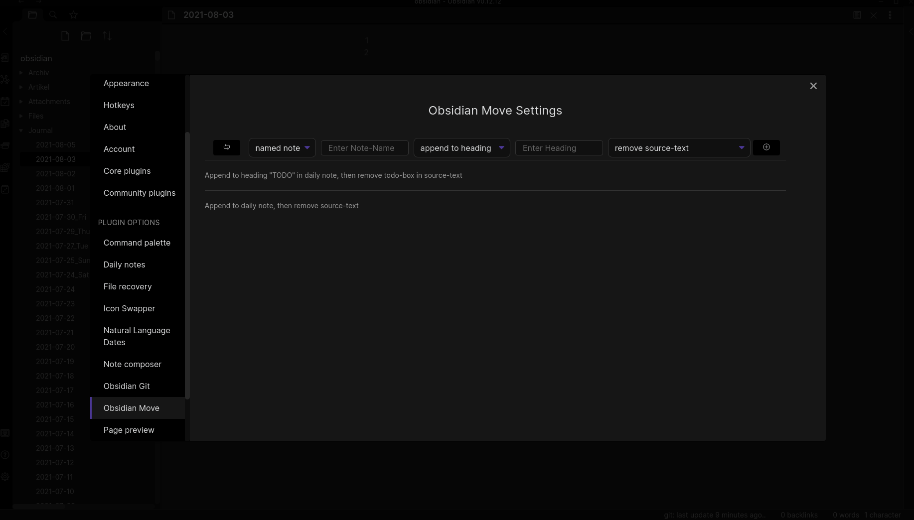

## Obsidian Move Plugin

Tired of manually moving text between re-occurring notes and headings? Then this plugin is for you: configure re-occuring moves as their own commands with a wide selection of methods for selecting, inserting and transforming the source text.

### Available options

- Selection Methods:

  - manually selecting text
  - TBD

- Note Types:

  - named note
  - daily note

- Insertion Methods:

  - append
  - append to heading
  - prepend
  - prepend to heading

- Source Transformations:
  - remove source-text
  - remove todo-box in source-text
